# 📊 Customer Feedback Sentiment Dashboard

An AI-powered dashboard to analyze customer feedback sentiment, group themes, and generate reports. Built with NestJS for scalability and Mistral AI for NLP.

---

## 🛠️ Stack

### **Core**

- **Backend**: NestJS (TypeScript)
- **Database**: PostgreSQL (Drizzle ORM)
- **Auth**: JWT + Redis (sessions/rate-limiting)
- **AI**: Mistral API (Sentiment Analysis + Topic Clustering)

### **Tools**

- **Validation**: Zod
- **API Docs**: Swagger
- **Testing**: Jest + Supertest
- **Linting/Formatting**: Biome
- **Queueing**: BullMQ (optional for async tasks)
- **Monitoring**: Prometheus + Grafana
- **Deployment**: Docker + Docker Compose
- **Type Checking and Linting**: Biome
- **CI/CD**: GitHub Actions
- **File**: PDF-lib and json2csv

---

## 🛠 How to Run

### 1. Clone the repository

```bash
git clone https://github.com/Xayrulloh/Feedback-Sentiment.git && cd Feedback-Sentiment
```

### 2. Create .env file:

```env
DATABASE_URL='postgresql://<user>:<password>@localhost:5432/<database>'
PORT=XXXX

# JWT
JWT_SECRET

# AI
OPENAI_API_KEY

# POSTGRES
POSTGRES_USER
POSTGRES_PASSWORD
POSTGRES_DB
POSTGRES_PORT
```

### 3. Run Database

```bash
docker compose up -d  # Starts PostgreSQL + Redis
npx drizzle-kit push:pg  # Apply DB schema
```

### 4. Start Server

```bash
pnpm run start:dev
```

### 5. Swagger Docs and server address

- **http://localhost:${PORT}/${GLOBAL_PREFIX}** server address
- **http://localhost:${PORT}/${GLOBAL_PREFIX}/docs** swagger docs

## 🧠 How It Works

### 1. Feedback Ingestion:

- CSV/text input → Validated → Stored in PostgreSQL.

### 2. AI Processing:

- Mistral API tags sentiment → Groups similar feedback via NLP.

### 3. Dashboard:

- Filter by sentiment, view trends, download reports.

## 🌐 Endpoints

### 🔐 Authentication Endpoints

#### **1. User Registration**

**Path**: `POST /auth/(register|login)`  
**Flow Register**:

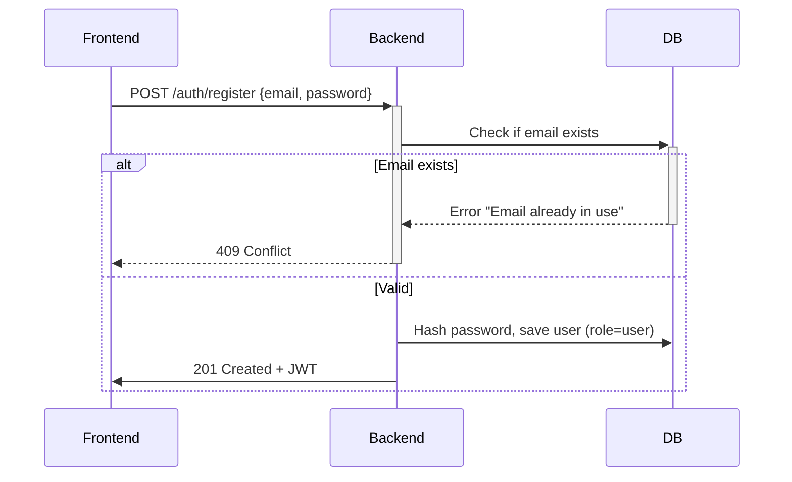

**Flow Login**:

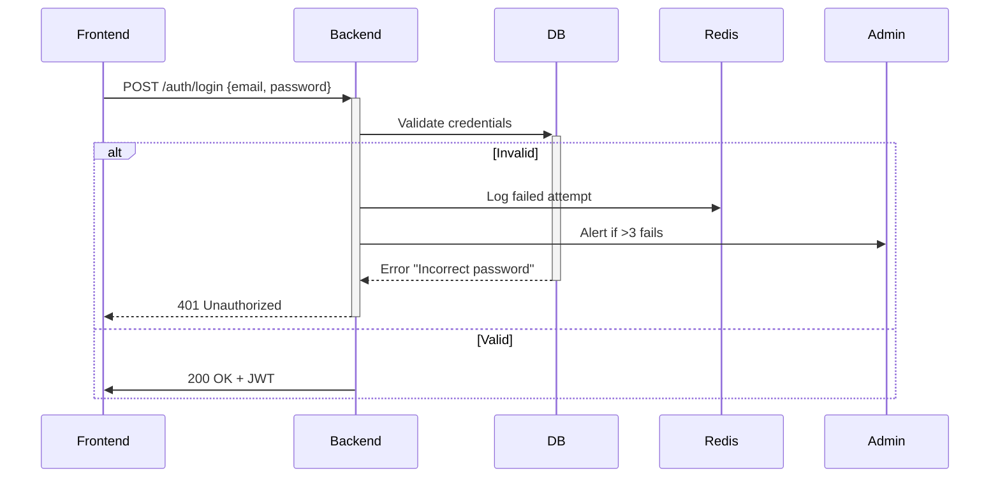

**Request Body**:

```json
{
  "email": "rYBmM@example.com",
  "password": "password123"
}
```

**Response (200/201)**:

```json
{
  "token": "eyJhbGciOi...",
  "role": "user",
  "redirectTo": "/dashboard"
}
```

**Error Response**:

- **409 Conflict:**

```json
{ "error": "Email already in use" }
```

- **400 Bad Request:**

```json
{ "error": "Password must be 8+ characters" }
```

- **401 Unauthorized:**

```json
{ "error": "Incorrect password" }
```

**JWT Token Structure:**

```json
{
  "sub": "123",
  "email": "user@example.com",
  "role": "user",
  "iat": 1734020000,
  "exp": 1734023600
}
```

**Security**

- **Password Hashing**: Bcrypt
- **Session Management**: Redis
- **Rate Limiting**: _5 attempts/hour_ per IP
- **Authorization**: JWT
- **Tokens expire in _1 hour_**

### 📥 Feedback Endpoints

#### **1. Upload Feedback via CSV**

**Path**: `POST /feedback/upload`  
**Flow**:

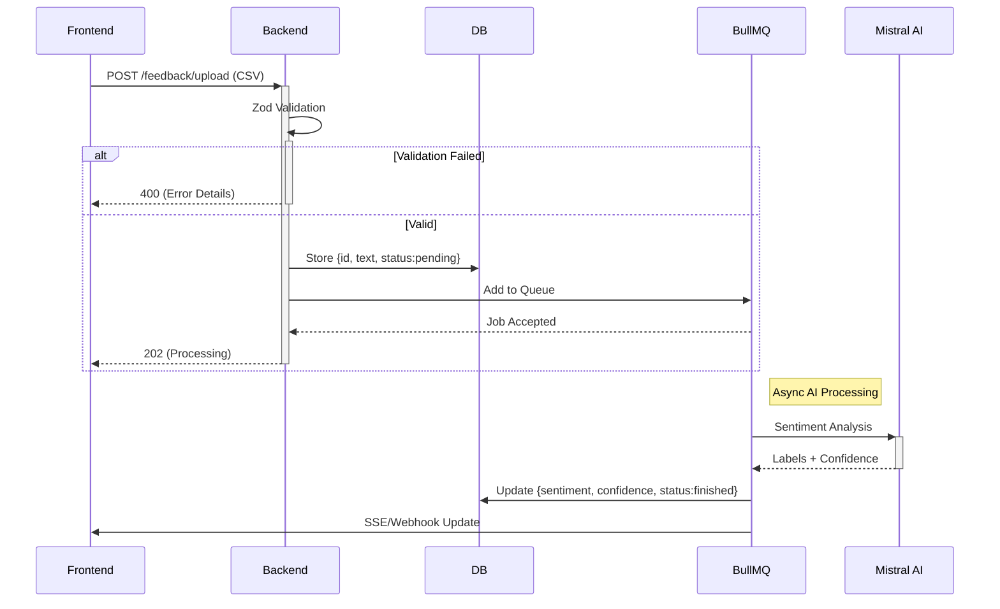

**Request Body**:

```json
curl -X POST -H "Authorization: Bearer {token}" -F "file=@feedback.csv" http://localhost:3000/feedback/upload
```

**Response (202)**:

```json
{
  "jobId": "550e8400-e29b-41d4-a716-446655440000",
  "status": "pending",
  "estimatedWait": 30
}
```

**Error Response**:

```json
{
  "error": "Invalid CSV structure",
  "details": "Missing required 'feedback' column"
}
```

#### **2. Manual Feedback Entry**

**Path**: `POST /feedback/manual`  
**Flow**:

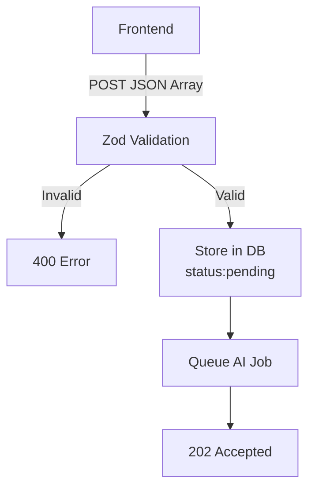

**Request Body**:

```json
[
  {
    "entries": ["Love this product!", "Shipping took too long"]
  }
]
```

**Response (202)**:

```json
{
  "jobId": "550e8400-e29b-41d4-a716-446655440001",
  "status": "pending",
  "itemCount": 2
}
```

**Error Response**:

```json
{
  "error": "Validation failed",
  "invalidEntries": [""]
}
```

#### **🤖 Internal AI Processing**

**BullMQ Job Handler:**

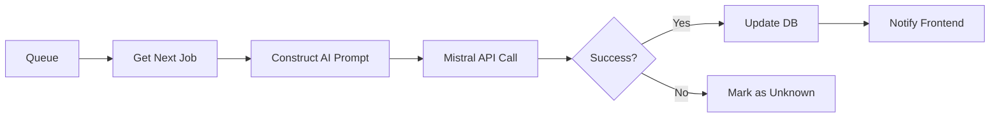

**Mistral AI Prompt Example:**

```text
Analyze sentiment for this customer feedback:
"{feedback_text}"

Respond ONLY with JSON format:
{
  "sentiment": "positive|neutral|negative",
  "confidence": 0-100
}
```

### **🧪 Try with Sample Data**

**Path**: `POST /feedback/sample`

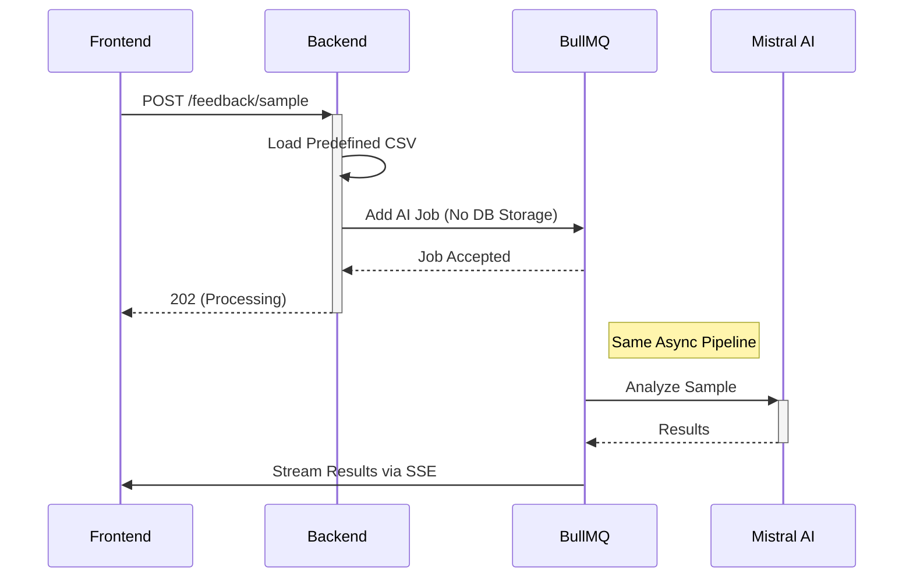

**Request Body**:

```json
curl -X POST -H "Authorization: Bearer {token}" http://localhost:3000/feedback/sample
```

**Response (202)**:

```json
{
  "jobId": "sample-123e4567",
  "status": "processing",
  "note": "Data will not be saved"
}
```

**Error Response**:

```json
{
  "error": "Validation failed",
  "invalidEntries": [""]
}
```

### 🔍 Filter Feedback by Sentiment

**Path**: `GET /feedback`  
**Flow**:

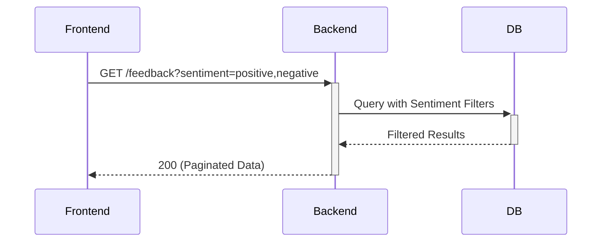

**Request**:

```bash
curl -X GET -H "Authorization: Bearer {token}" \
  "http://localhost:3000/feedback?sentiment=positive,neutral&limit=10"
```

**Query Params**:
| Param | Type | Required | Description |
| --- | --- | --- | --- |
| sentiment | CSV list | No | Values: positive, neutral, negative, unknown |
| limit | integer | No | Items per page (default: 20) |
| page | integer | No | Pagination offset (default: 1) |

**Response (200)**:

```json
{
  "data": [
    {
      "id": "123",
      "text": "Great product!",
      "sentiment": "positive",
      "confidence": 92,
      "createdAt": "2024-03-20T12:00:00Z"
    }
  ],
  "meta": {
    "totalItems": 42,
    "totalPages": 5,
    "currentPage": 1
  }
}
```

### 📊 Sentiment Summary

**Path**: `GET /feedback/summary`  
**Flow**:

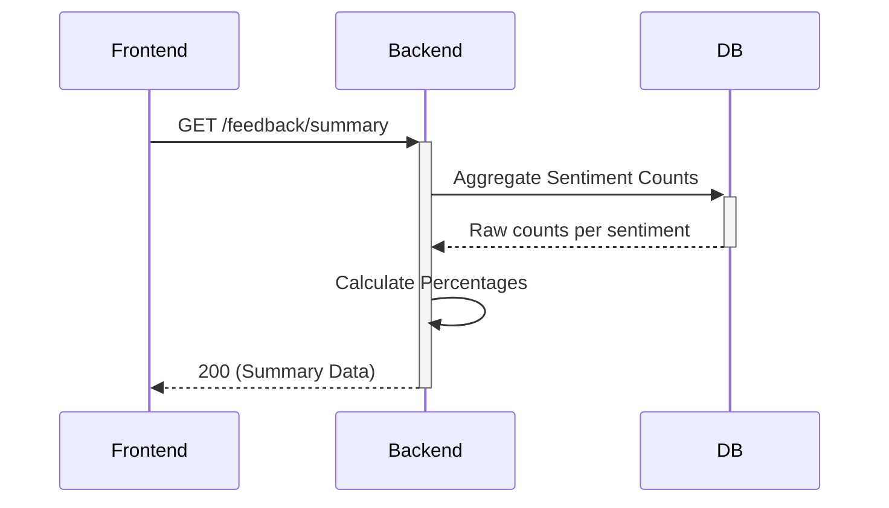

**Request**:

```bash
curl -X GET -H "Authorization: Bearer {token}" \
  http://localhost:3000/feedback/summary
```

**Response (200)**:

```json
{
  "summary": {
    "positive": {
      "count": 42,
      "percentage": 52.5
    },
    "neutral": {
      "count": 20,
      "percentage": 25.0
    },
    "negative": {
      "count": 15,
      "percentage": 18.75
    },
    "unknown": {
      "count": 3,
      "percentage": 3.75
    }
  },
  "total": 80
}
```

**Real Time Updates**:
_Frontend can poll or use SSE to refresh when new data arrives (response will be same):_

```bash
# SSE channel for updates
GET /feedback/updates
```

### 📥 Download Sentiment Report (Backend)

- **1. Detailed Report (All Entries)**

**Path**: `GET /feedback/report/detailed?format=csv|pdf`  
**Flow**:

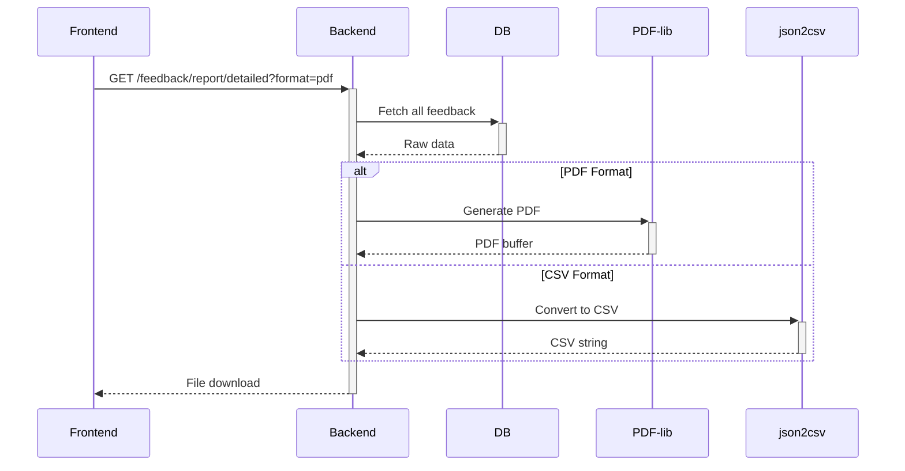

- **2. Summary Report (Aggregated)**

**Path**: `GET /feedback/report/summary?format=csv|pdf`  
**Flow**:

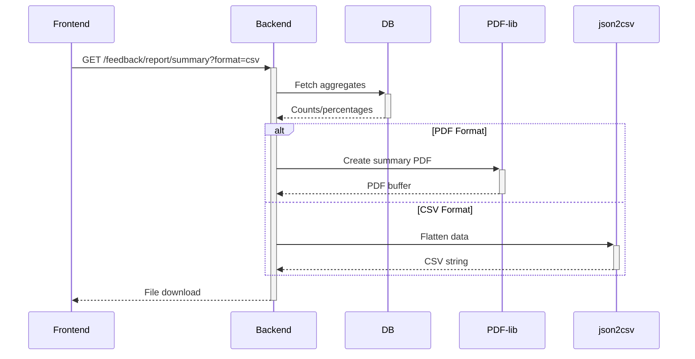

**Request**:

```bash
# Detailed PDF Report
curl -X GET -H "Authorization: Bearer {token}" \
  "http://localhost:3000/feedback/report/detailed?format=pdf" \
  --output report.pdf

# Summary CSV Report
curl -X GET -H "Authorization: Bearer {token}" \
  "http://localhost:3000/feedback/report/summary?format=csv" \
  --output summary.csv
```

**Response (200) Headers**:

_For PDF file_

```http
Content-Type: application/pdf
Content-Disposition: attachment; filename="report_20240820.pdf"
```

_For CSV file_

```http
Content-Type: text/csv
Content-Disposition: attachment; filename="summary_20240820.csv"
```

**Data structure**:

_Detailed Report (CSV Example):_

```csv
feedback,sentiment,confidence,group
"Great product!",positive,92%,Product Satisfaction
"Late delivery",negative,85%,Shipping Issues
```

_Summary Report (PDF Content):_

```text
SENTIMENT SUMMARY REPORT
────────────────────────
Positive: 42 (52.5%)
Neutral: 20 (25.0%)
Negative: 15 (18.75%)
Unknown: 3 (3.75%)

Most Common Groups:
1. Shipping Issues (12)
2. Product Quality (8)
```

<!-- ### 👨‍💼 Admin Dashboard (Security) FIXME: will be implemented in future -->

## 🗃️ Database Schema

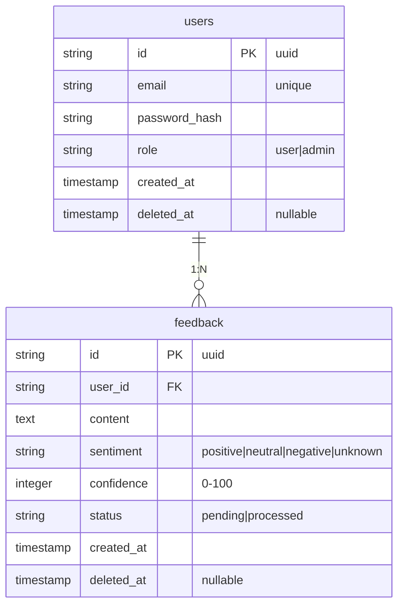