# 📊 Customer Feedback Sentiment Dashboard

An AI-powered dashboard to analyze customer feedback sentiment, group themes, and generate reports. Built with NestJS for scalability and Mistral AI for NLP.

---

## 🛠️ Stack

### **Core**

- **Backend**: NestJS (TypeScript)
- **Database**: PostgreSQL (Drizzle ORM)
- **Auth**: JWT
- **AI**: Mistral API (Sentiment Analysis + Topic Clustering)
- **Caching**: Redis (Data is cached using Redis)

### **Tools**

- **Validation**: Zod + NestJS-Zod
- **API Docs**: Swagger
- **Testing**: Jest + Supertest
- **Linting/Formatting**: Biome
- **File Processing**: Multer (uploads), PapaParse (CSV)
- **Monitoring**: Prometheus + Grafana + Loki
- **Deployment**: Docker + Docker Compose
- **CI/CD**: GitHub Actions
- **PDF Generation:** PDF-lib
- **CSV Export:** JSON2CSV
- **Real-time:** Socket.IO

---

## 🛠 How to Run

### 1. Clone the repository

```bash
git clone https://github.com/Xayrulloh/Feedback-Sentiment.git && cd Feedback-Sentiment
```

### 2. Create .env file:

```env
DATABASE_URL='postgresql://<user>:<password>@localhost:5432/<database>'
PORT=XXXX

# JWT
JWT_SECRET=

# AI
OPENAI_API_KEY

# POSTGRES
POSTGRES_USER
POSTGRES_PASSWORD
POSTGRES_DB
POSTGRES_PORT

# Redis
REDIS_HOST
REDIS_PORT
```

### 3. Start App and Database

```bash
docker compose build # 1️⃣ Builds the app image
docker compose up -d  # 2️⃣ Starts all services (DB, Redis, App, Prometheus, Grafana, Loki, Promtail) in the background
pnpm drizzle:push # 3️⃣ Applies database migrations once the DB is healthy
```

### 4. Swagger Docs and server address

- **http://localhost:${PORT}/${GLOBAL_PREFIX}** server address
- **http://localhost:${PORT}/${GLOBAL_PREFIX}/docs** swagger docs

## 🧠 How It Works

### 1. Feedback Ingestion:

- CSV/text feedbacks input → AI Processing → Stored in PostgreSQL.

### 2. AI Processing:

- Mistral API tags sentiment → Groups similar feedback via NLP -> Tells confidence

### 3. Dashboard:

- Filter by sentiment, group themes, download reports, bar charts.

### 4. Admin Dashboard:

- Get users -> Disable users -> Suspend users ->
- Get suspicious activity (Registration/Upload/Download/API)
- Rate limit (API/Upload/Download/Login)

## 🌐 Endpoints

### 🔐 Authentication Endpoints

#### **1. User Registration**

**Path**: `POST /auth/(register|login)`  
**Flow Register/Login**:

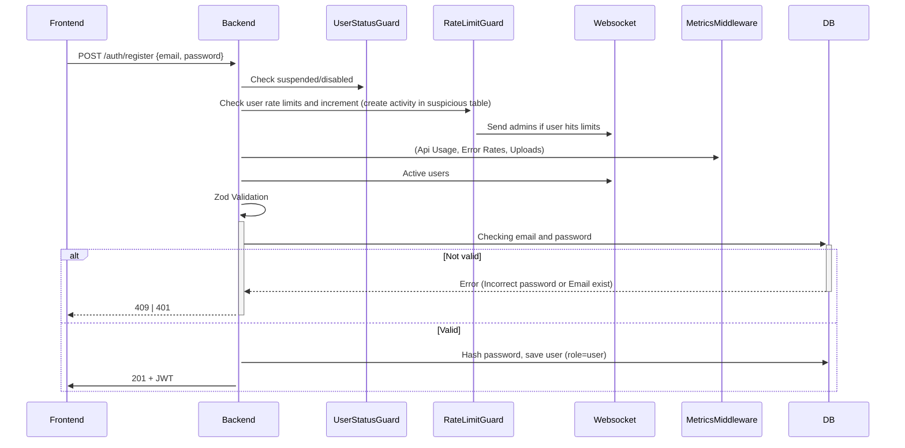

#### **2. Admin Registration**

**Path**: `POST /auth/(register|login)/admin`  
**Flow Register/Login**:

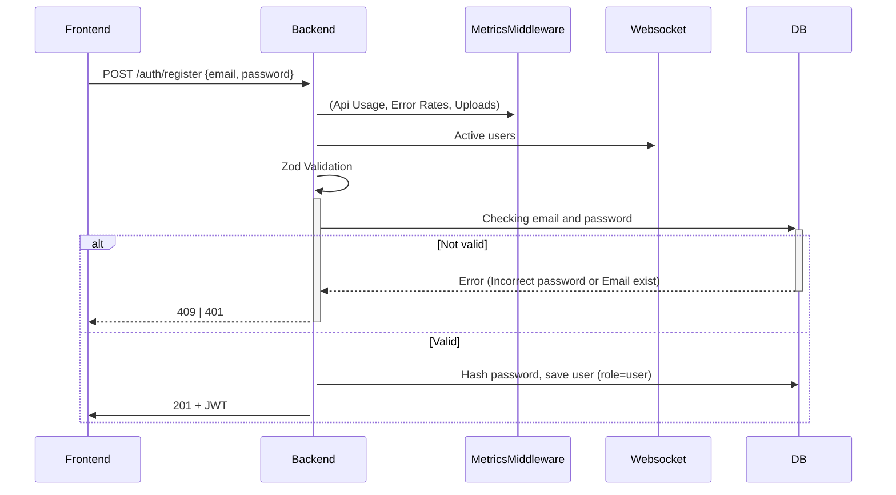

### 📥 Feedback Endpoints

#### **1. Feedback Manual**

**Path**: `POST /workspaces/{workspaceId}/feedbacks/manual`
**Flow**:

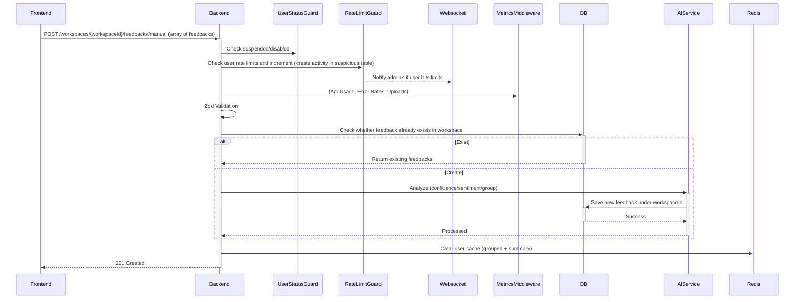

#### **2. Upload Feedback via CSV**

**Path**: `POST /workspaces/{workspaceId}/feedbacks/upload`  
**Flow**:

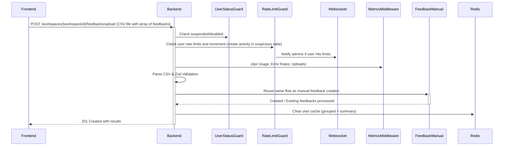

#### **3. Get Feedback by ID**

**Path**: `GET /workspaces/{workspaceId}/feedbacks/{id}
`  
**Flow**:

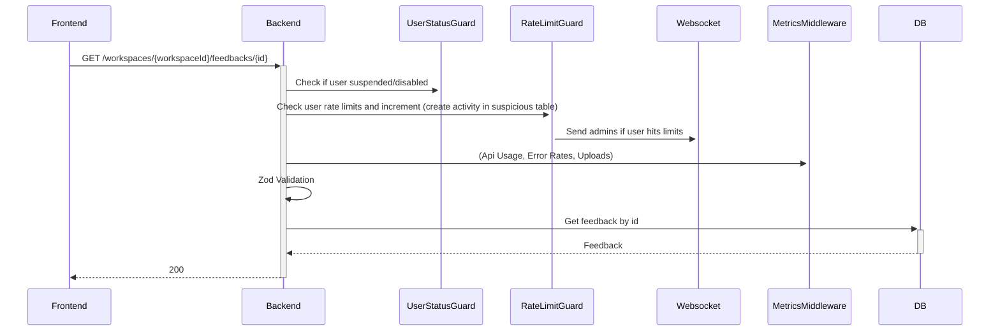

#### **4. Filter Feedback by Sentiment with/without workspaceId**

**Path**: `GET /workspaces/:workspaceId?/feedbacks`  
**Flow**:

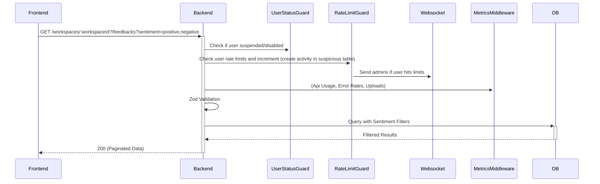

#### **5. Get Feedback Summary with/without workspaceId**

**Path**: `GET /workspaces/:workspaceId?/feedbacks/sentiment-summary`  
**Flow**:

```mermaid
sequenceDiagram
    Frontend->>+Backend: GET /workspaces/:workspaceId?/feedbacks/sentiment-summary
    Backend->>+UserStatusGuard: Check if user suspended/disabled
    Backend->>+RateLimitGuard: Check user rate limits and increment, create activity in suspicious table
    RateLimitGuard->>+Websocket: Notify admins if user hits limits
    Backend->>+MetricsMiddleware: `Api Usage, Error Rates, Uploads`
    Backend->>Backend: Zod Validation
    Backend->>+Redis: `Check cache (feedback:sentiment-summary:{userId}:{workspaceId?})`
    alt Cache hit
        Redis-->>-Backend: Return cached summary
        Backend-->>-Frontend: 200
    else Cache miss
        Backend->>+DB: Aggregate sentiment counts + percentages
        DB-->>-Backend: Grouped Results
        Backend->>+Redis: Store summary with TTL
        Backend-->>-Frontend: 200
    end
```

#### **6. Get Feedback Grouped with/without workspaceId**

**Path**: `GET /workspaces/:workspaceId?/feedbacks/grouped`
**Flow**:

```mermaid
sequenceDiagram
    Frontend->>+Backend: GET /workspaces/:workspaceId?/feedbacks/grouped
    Backend->>+UserStatusGuard: Check if user suspended/disabled
    Backend->>+RateLimitGuard: Check user rate limits and increment (create activity in suspicious table)
    RateLimitGuard->>+Websocket: Notify admins if user hits limits
    Backend->>+MetricsMiddleware: `Api Usage, Error Rates, Uploads`
    Backend->>Backend: Zod Validation
    Backend->>+Redis: `Check cache (feedback:grouped:{userId}:{workspaceId?})`
    alt Cache hit
        Redis-->>-Backend: Return cached groups
        Backend-->>-Frontend: 200
    else Cache miss
        Backend->>+DB: Aggregate feedback grouped by summary
        DB-->>-Backend: Grouped results with items
        Backend->>+Redis: Store grouped results with TTL
        Backend-->>-Frontend: 200
    end
```

#### **7. Get Feedback Report file (CSV/PDF) with/without workspaceId**

**Path**: `GET /workspaces/:workspaceId?/feedbacks/report`
**Flow**:

```mermaid
sequenceDiagram
    Frontend->>+Backend: GET /workspaces/:workspaceId?/feedbacks/report
    Backend->>+UserStatusGuard: Check if user suspended/disabled
    Backend->>+RateLimitGuard: Check user rate limits and increment (create activity in suspicious table)
    RateLimitGuard->>+Websocket: Notify admins if user hits limits
    Backend->>+MetricsMiddleware: `Api Usage, Error Rates, Uploads`
    Backend->>Backend: Zod Validation
    Backend->>+Redis: `Check cache (feedback:report:{userId}:{workspaceId?}:{type}:{format})`
    alt Cache hit
        Redis-->>-Backend: Return cached file (Base64 buffer)
        Backend-->>-Frontend: File download
    else Cache miss - Detailed report
        Backend->>+DB: Fetch all feedback
        DB-->>-Backend: Raw data
        Backend->>+FileGenerator: Generate file (CSV/PDF)
        FileGenerator-->>-Backend: File buffer
        Backend->>+Redis: Store file buffer (Base64) with TTL
        Backend-->>-Frontend: File download
    else Cache miss - Summary report
        Backend->>+DB: Aggregate feedback summary
        DB-->>-Backend: Summary data
        Backend->>+FileGenerator: Generate file (CSV/PDF)
        FileGenerator-->>-Backend: File buffer
        Backend->>+Redis: Store file buffer (Base64) with TTL
        Backend-->>-Frontend: File download
    end
```

### 📁 File Endpoints

#### **1. Get All Files with/without workspaceId**

**Path**: `GET /workspaces/:workspaceId?/files`  
**Flow**:

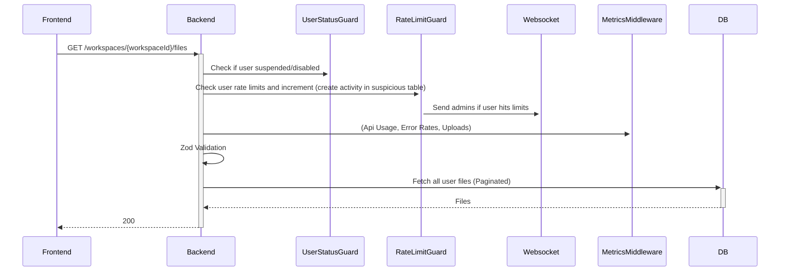

#### **3. Delete File**

**Path**: `DELETE /workspaces/{workspaceId}/files/{fileId}`  
**Flow**:

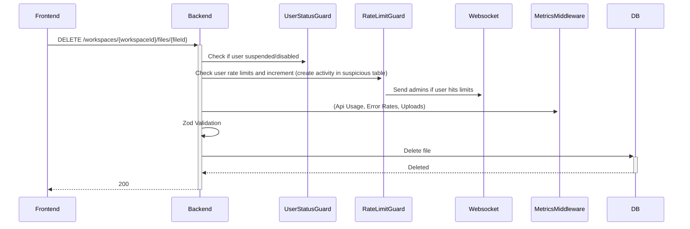

### 🤨 User Endpoints

#### **1. Get Users**

**Path**: `GET /users`  
**Flow**:


#### **2. Search Users**

**Path**: `GET /users/search`  
**Flow**:

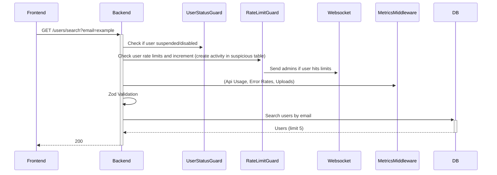

### 🔒 Admin Endpoints

#### **1. Disable User**

**Path**: `POST /admins/disable/:userId`
**Flow**:

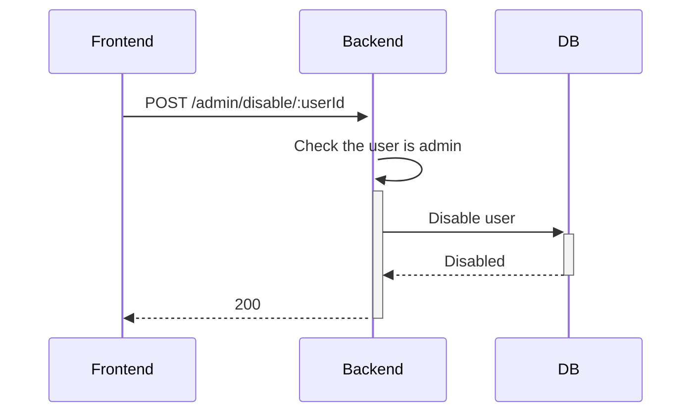

#### **2. Suspend User**

**Path**: `POST /admins/suspend/:userId`
**Flow**:

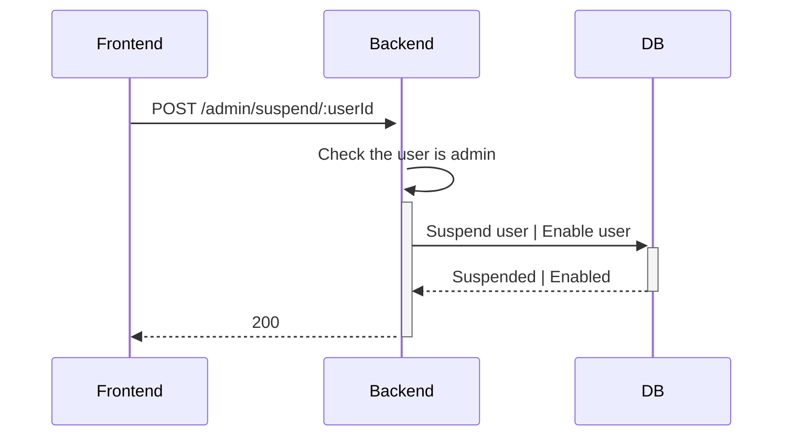

#### **3. Metrics**

**Path**: `GET /admins/metrics`
**Flow**:

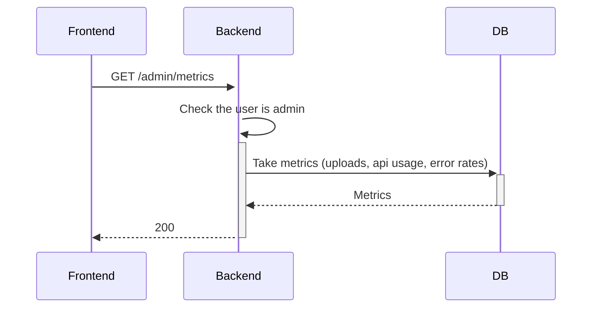

#### **4. Rate Limit**

**Path**: `GET /admins/rate-limit`
**Flow**:

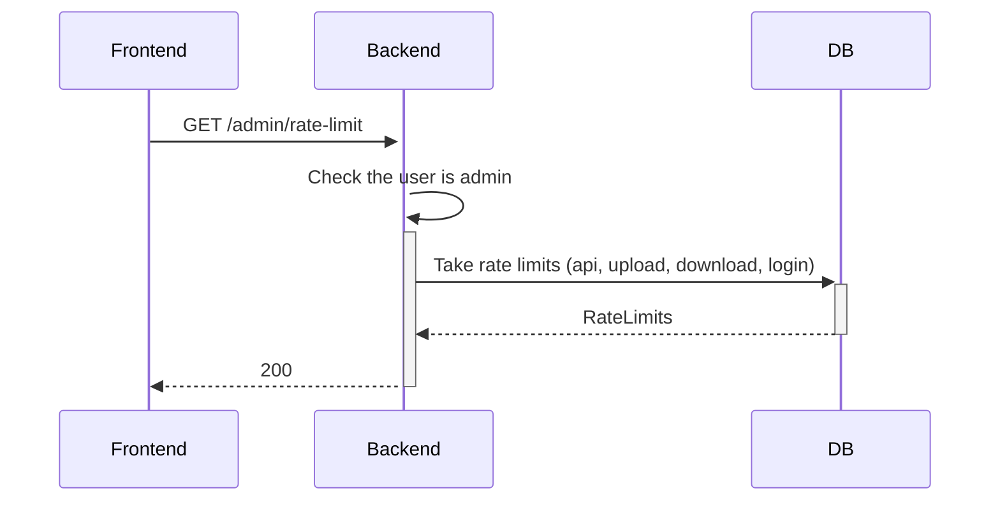

#### **5. Rate Limit**

**Path**: `PATCH /admins/rate-limit`
**Flow**:

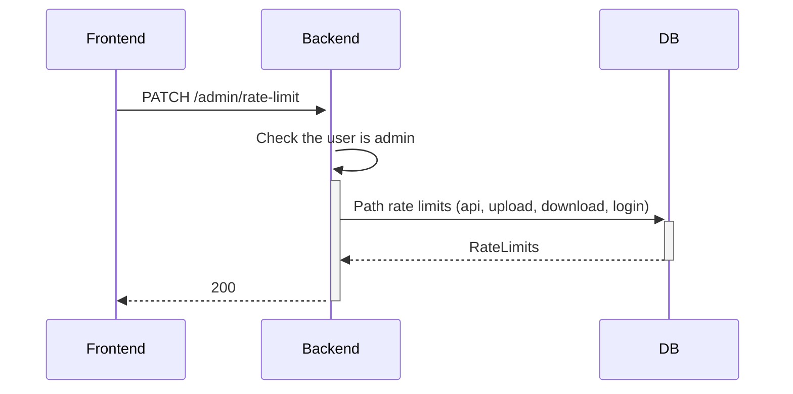

#### **6. Suspicious Activity**

**Path**: `GET /admins/suspicious-activities`
**Flow**:

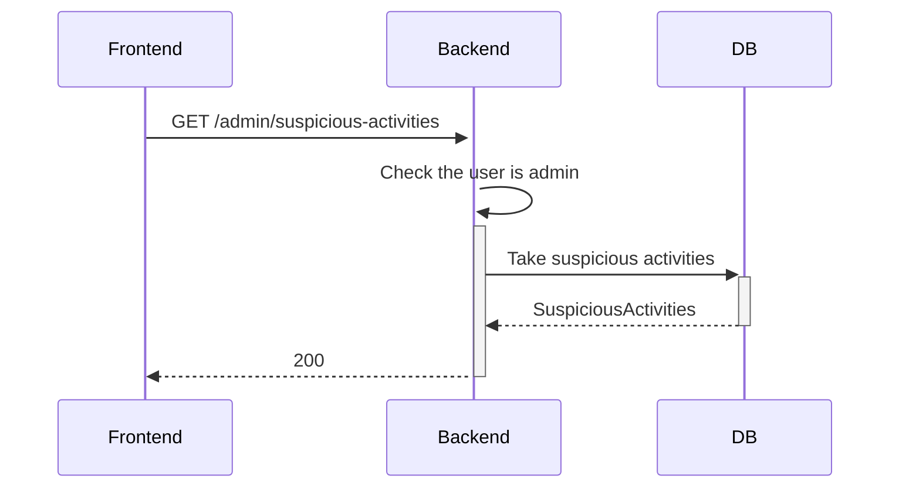

### 📜 Sample Feedback Endpoints

#### **1. Sample Filter Feedback by Sentiment**

**Path**: `GET /samples/feedbacks/filtered`  
**Flow**:

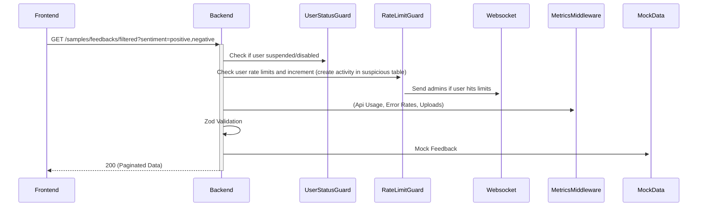

#### **2. Sample Get Feedback Summary**

**Path**: `GET /samples/feedbacks/sentiment-summary`  
**Flow**:

```mermaid
sequenceDiagram
    Frontend->>+Backend: GET /sample/feedback-sentiment-summary
    Backend->>+UserStatusGuard: Check if user suspended/disabled
    Backend->>+RateLimitGuard: Check user rate limits and increment (create activity in suspicious table)
    RateLimitGuard->>+Websocket: Send admins if user hits limits
    Backend->>+MetricsMiddleware: (Api Usage, Error Rates, Uploads)
    Backend->>Backend: Zod Validation
    Backend->>+MockData: Mock Feedback
    Backend-->>-Frontend: 200
```

#### **3. Sample Get Feedback Grouped**

**Path**: `GET /samples/feedbacks/grouped`
**Flow**:

```mermaid
sequenceDiagram
    Frontend->>+Backend: GET /samples/feedbacks/grouped
    Backend->>+UserStatusGuard: Check if user suspended/disabled
    Backend->>+RateLimitGuard: Check user rate limits and increment (create activity in suspicious table)
    RateLimitGuard->>+Websocket: Send admins if user hits limits
    Backend->>+MetricsMiddleware: (Api Usage, Error Rates, Uploads)
    Backend->>Backend: Zod Validation
    Backend->>+MockData: Mock Feedback
    Backend-->>-Frontend: 200
```
### 📜 Workspaces Crud Endpoints

#### **1. Create a workspace**

**Path**: `POST /api/workspaces`  
**Flow**:

```mermaid
sequenceDiagram
    Frontend->>+Backend: POST /api/workspaces
    Backend->>+UserStatusGuard: Check if user suspended/disabled
    Backend->>+RateLimitGuard: Check user rate limits and increment (create activity in suspicious table)
    RateLimitGuard->>+Websocket: Send admins if user hits limits
    Backend->>+MetricsMiddleware: (Api Usage, Error Rates, Uploads)
    Backend->>Backend: Zod Validation
    Backend->>+Workspace: Add workspace
    Backend-->>-Frontend: 201 (Paginated Data)
```

#### **2. Get all workspaces**

**Path**: `GET /api/workspaces`  
**Flow**:

```mermaid
sequenceDiagram
    Frontend->>+Backend: GET /api/workspaces
    Backend->>+UserStatusGuard: Check if user suspended/disabled
    Backend->>+RateLimitGuard: Check user rate limits and increment (create activity in suspicious table)
    RateLimitGuard->>+Websocket: Send admins if user hits limits
    Backend->>+MetricsMiddleware: (Api Usage, Error Rates, Uploads)
    Backend->>Backend: Zod Validation
    Backend->>Workspace: Get all workspace
    Backend-->>-Frontend: 200 (Paginated Data)
```

#### **3. Get a workspace by Id**

**Path**: `GET /api/workspaces/{id}`  
**Flow**:

```mermaid
sequenceDiagram
    Frontend->>+Backend: GET /api/workspaces/{id}
    Backend->>+UserStatusGuard: Check if user suspended/disabled
    Backend->>+RateLimitGuard: Check user rate limits and increment (create activity in suspicious table)
    RateLimitGuard->>+Websocket: Send admins if user hits limits
    Backend->>+MetricsMiddleware: (Api Usage, Error Rates, Uploads)
    Backend->>Backend: Zod Validation
    Backend->>Workspace: Get workspace by id
    Backend-->>-Frontend: 200 (Paginated Data)
```

#### **4. Update a workspace by Id**

**Path**: `PUT /api/workspaces/{id}`  
**Flow**:

```mermaid
sequenceDiagram
    Frontend->>+Backend: PUT /api/workspaces/{id}
    Backend->>+UserStatusGuard: Check if user suspended/disabled
    Backend->>+RateLimitGuard: Check user rate limits and increment (create activity in suspicious table)
    RateLimitGuard->>+Websocket: Send admins if user hits limits
    Backend->>+MetricsMiddleware: (Api Usage, Error Rates, Uploads)
    Backend->>Backend: Zod Validation
    Backend->>Workspace: Update workspace by id
    Backend-->>-Frontend: 200 (Paginated Data)
```

#### **5. DELETE a workspace by Id**

**Path**: `DELETE /api/workspaces/{id}`  
**Flow**:

```mermaid
sequenceDiagram
    Frontend->>+Backend: DELETE /api/workspaces/{id}
    Backend->>+UserStatusGuard: Check if user suspended/disabled
    Backend->>+RateLimitGuard: Check user rate limits and increment (create activity in suspicious table)
    RateLimitGuard->>+Websocket: Send admins if user hits limits
    Backend->>+MetricsMiddleware: (Api Usage, Error Rates, Uploads)
    Backend->>Backend: Zod Validation
    Backend->>Workspace: DELETE workspace by id
    Backend-->>-Frontend: 200 (Paginated Data)
```

## 🗃️ Database Schema

```mermaid
erDiagram
    users ||--o{ workspaces : "1:N"
    users ||--o{ files : "1:N"
    users ||--o{ users_feedbacks : "1:N"
    users ||--o{ suspicious_activity : "1:N"
    workspaces ||--o{ files : "1:N"
    workspaces ||--o{ users_feedbacks : "1:N"
    feedbacks ||--o{ users_feedbacks : "1:N"
    files ||--o{ users_feedbacks : "1:N"

    users {
        uuid id PK
        string email "unique"
        string password_hash
        enum role "user|admin"
        boolean is_suspended "default false"
        timestamp created_at
        timestamp updated_at
        timestamp deleted_at "nullable"
    }

    workspaces {
        uuid id PK
        string name
        uuid user_id FK
        timestamp created_at
        timestamp updated_at
        timestamp deleted_at "nullable"
    }

    files {
        uuid id PK
        uuid user_id FK
        uuid workspace_id FK
        string name
        string mime_type
        bigint size "bytes"
        integer row_count "nullable"
        string extension
        timestamp created_at
        timestamp updated_at
        timestamp deleted_at "nullable"
    }

    feedbacks {
        uuid id PK
        string content_hash "unique, sha256"
        text content
        enum sentiment "positive|neutral|negative|unknown"
        integer confidence "0-100"
        text summary "AI-generated"
        timestamp created_at
        timestamp updated_at
        timestamp deleted_at "nullable"
    }

    users_feedbacks {
        uuid id PK
        uuid user_id FK
        uuid feedback_id FK
        uuid workspace_id FK
        uuid file_id FK "nullable"
        timestamp created_at
        timestamp updated_at
        timestamp deleted_at "nullable"
    }

    rate_limits {
        uuid id PK
        enum target "api|upload|download|login"
        integer limit
        timestamp created_at
        timestamp updated_at
        timestamp deleted_at "nullable"
    }

    suspicious_activity {
        uuid id PK
        uuid user_id FK "nullable"
        string email "nullable"
        string ip "nullable"
        enum action "api|upload|download|login"
        enum error "too_many_*"
        text details "nullable"
        timestamp created_at
        timestamp updated_at
        timestamp deleted_at "nullable"
    }
```
