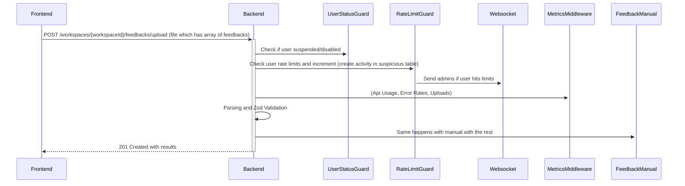
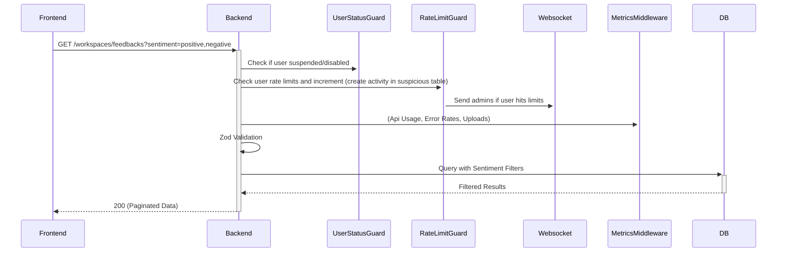
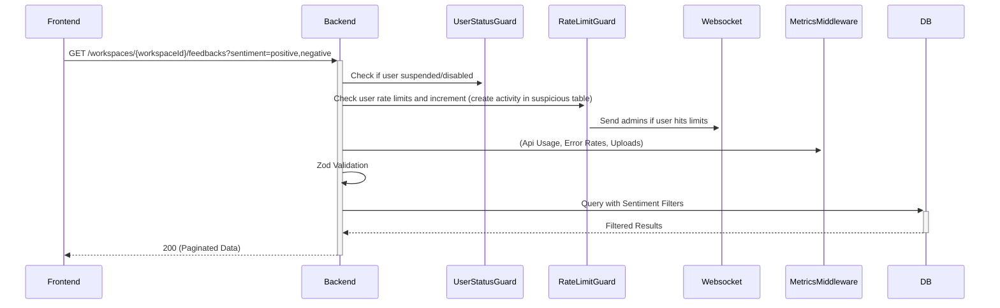
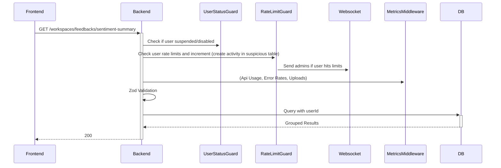
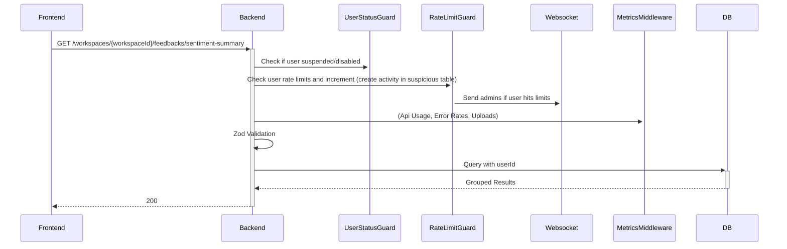
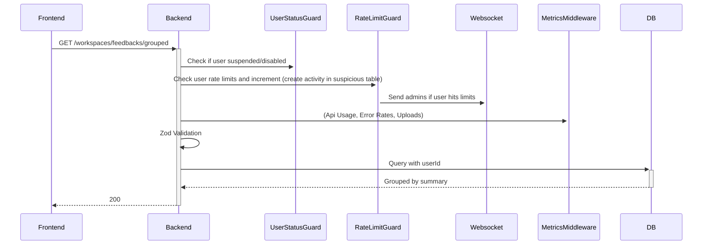
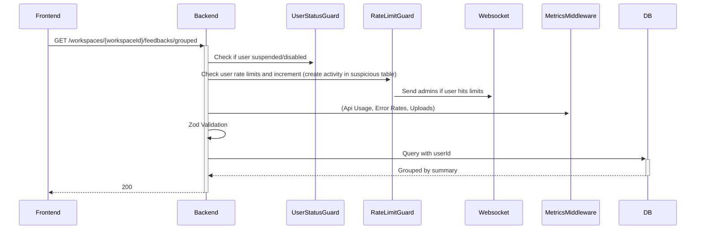
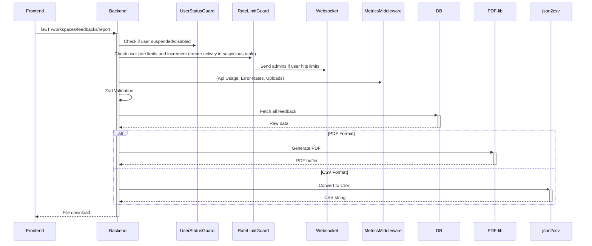
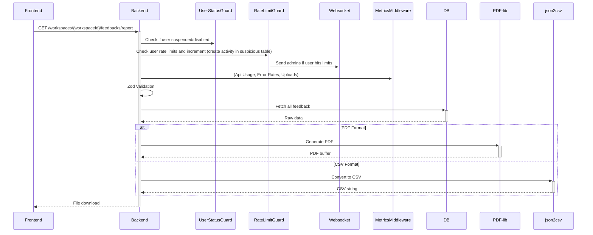

# 📊 Customer Feedback Sentiment Dashboard

An AI-powered dashboard to analyze customer feedback sentiment, group themes, and generate reports. Built with NestJS for scalability and Mistral AI for NLP.

---

## 🛠️ Stack

### **Core**

- **Backend**: NestJS (TypeScript)
- **Database**: PostgreSQL (Drizzle ORM)
- **Auth**: JWT + Redis (sessions/rate-limiting)
- **AI**: Mistral API (Sentiment Analysis + Topic Clustering)

### **Tools**

- **Validation**: Zod + NestJS-Zod
- **API Docs**: Swagger
- **Testing**: Jest + Supertest
- **Linting/Formatting**: Biome
- **File Processing**: Multer (uploads), PapaParse (CSV)
- **Monitoring**: Prometheus + Grafana + Loki
- **Deployment**: Docker + Docker Compose
- **CI/CD**: GitHub Actions
- **PDF Generation:** PDF-lib
- **CSV Export:** JSON2CSV
- **Real-time:** Socket.IO

---

## 🛠 How to Run

### 1. Clone the repository

```bash
git clone https://github.com/Xayrulloh/Feedback-Sentiment.git && cd Feedback-Sentiment
```

### 2. Create .env file:

```env
DATABASE_URL='postgresql://<user>:<password>@localhost:5432/<database>'
PORT=XXXX

# JWT
JWT_SECRET=

# AI
OPENAI_API_KEY

# POSTGRES
POSTGRES_USER
POSTGRES_PASSWORD
POSTGRES_DB
POSTGRES_PORT

# Redis
REDIS_HOST
REDIS_PORT
```

### 3. Run Database

```bash
docker compose up -d  # Starts PostgreSQL + Redis
npx drizzle-kit push:pg  # Apply DB schema
```

### 4. Start Server

```bash
pnpm run start:dev
```

### 5. Swagger Docs and server address

- **http://localhost:${PORT}/${GLOBAL_PREFIX}** server address
- **http://localhost:${PORT}/${GLOBAL_PREFIX}/docs** swagger docs

## 🧠 How It Works

### 1. Feedback Ingestion:

- CSV/text feedbacks input → AI Processing → Stored in PostgreSQL.

### 2. AI Processing:

- Mistral API tags sentiment → Groups similar feedback via NLP -> Tells confidence

### 3. Dashboard:

- Filter by sentiment, group themes, download reports, bar charts.

### 4. Admin Dashboard:

- Get users -> Disable users -> Suspend users ->
- Get suspicious activity (Registration/Upload/Download/API)
- Rate limit (API/Upload/Download/Login)

## 🌐 Endpoints

### 🔐 Authentication Endpoints

#### **1. User Registration**

**Path**: `POST /auth/(register|login)`  
**Flow Register/Login**:


#### **2. Admin Registration**

**Path**: `POST /auth/(register|login)/admin`  
**Flow Register/Login**:


### 📥 Feedback Endpoints

#### **1. Feedback Manual**

**Path**: `POST /workspaces/{workspaceId}/feedbacks/manual`
**Flow**:

```mermaid
sequenceDiagram
    Frontend->>+Backend: POST /workspaces/{workspaceId}/feedbacks/manual (array of feedbacks)
    Backend->>+UserStatusGuard: Check suspended/disabled
    Backend->>+RateLimitGuard: Check user rate limits and increment (create activity in suspicious table)
    RateLimitGuard->>+Websocket: Notify admins if user hits limits
    Backend->>+MetricsMiddleware: (Api Usage, Error Rates, Uploads)
    Backend->>Backend: Zod Validation
    Backend->>+DB: Check whether feedback already exists in workspace
    alt Exist
        DB-->>-Backend: Return existing feedbacks
        Backend-->>-Frontend: 201
    else Create
        Backend->>+AIService: Analyze (confidence/sentiment/group)
        AIService->>+DB: Save new feedback under workspaceId
        DB-->>-AIService: Success
        AIService-->>-Backend: Processed
        Backend-->>-Frontend: 201
    end
```

#### **2. Upload Feedback via CSV**

**Path**: `POST /workspaces/{workspaceId}/feedbacks/upload`  
**Flow**:



#### **3. Get Feedback by ID**

**Path**: `GET /workspaces/{workspaceId}/feedbacks/{id}
`  
**Flow**:


#### **4. Filter Feedback by Sentiment**

**Path**: `GET /workspaces/feedbacks`  
**Flow**:



#### **5. Filter Feedback by Sentiment based on workspace**

**Path**: `GET /workspaces/{workspaceId}/feedbacks`  
**Flow**:



#### **6. Get Feedback Summary**

**Path**: `GET /workspaces/feedbacks/sentiment-summary`  
**Flow**:



#### **7. Get Feedback Summary based on workspace**

**Path**: `GET /workspaces/{workspaceId}/feedbacks/sentiment-summary`  
**Flow**:



#### **8. Get Feedback Grouped**

**Path**: `GET /workspaces/feedbacks/grouped`
**Flow**:



#### **9. Get Feedback Grouped based on workspace**

**Path**: `GET /workspaces/{workspaceId}/feedbacks/grouped`
**Flow**:



#### **10. Get Feedback Report file (CSV/PDF)**

**Path**: `GET /workspaces/feedbacks/report`
**Flow**:



#### **11. Get Feedback Report file (CSV/PDF) based on workspace**

**Path**: `GET /workspaces/{workspaceId}/feedbacks/report`
**Flow**:



### 📁 File Endpoints

#### **1. Get All Files regardles of a specific workspace**

**Path**: `GET /workspaces/files`  
**Flow**:


#### **2. Get All Files based on a workspace**

**Path**: `GET /workspaces/{workspaceId}/files`  
**Flow**:


#### **3. Delete File**

**Path**: `DELETE /workspaces/{workspaceId}/files/{fileId}`  
**Flow**:


### 🤨 User Endpoints

#### **1. Get Users**

**Path**: `GET /users`  
**Flow**:


#### **2. Search Users**

**Path**: `GET /users/search`  
**Flow**:


### 🔒 Admin Endpoints

#### **1. Disable User**

**Path**: `POST /admins/disable/:userId`
**Flow**:


#### **2. Suspend User**

**Path**: `POST /admins/suspend/:userId`
**Flow**:


#### **3. Metrics**

**Path**: `GET /admins/metrics`
**Flow**:

```mermaid
sequenceDiagram
    Frontend->>+Backend: GET /admin/metrics
    Backend->>+Backend: Check the user is admin
    Backend->>+DB: Take metrics (uploads, api usage, error rates)
    DB-->>-Backend: Metrics
    Backend-->>-Frontend: 200
```

#### **4. Rate Limit**

**Path**: `GET /admins/rate-limit`
**Flow**:

```mermaid
sequenceDiagram
    Frontend->>+Backend: GET /admin/rate-limit
    Backend->>+Backend: Check the user is admin
    Backend->>+DB: Take rate limits (api, upload, download, login)
    DB-->>-Backend: RateLimits
    Backend-->>-Frontend: 200
```

#### **5. Rate Limit**

**Path**: `PATCH /admins/rate-limit`
**Flow**:

```mermaid
sequenceDiagram
    Frontend->>+Backend: PATCH /admin/rate-limit
    Backend->>+Backend: Check the user is admin
    Backend->>+DB: Path rate limits (api, upload, download, login)
    DB-->>-Backend: RateLimits
    Backend-->>-Frontend: 200
```

#### **6. Suspicious Activity**

**Path**: `GET /admins/suspicious-activities`
**Flow**:

```mermaid
sequenceDiagram
    Frontend->>+Backend: GET /admin/suspicious-activities
    Backend->>+Backend: Check the user is admin
    Backend->>+DB: Take suspicious activities
    DB-->>-Backend: SuspiciousActivities
    Backend-->>-Frontend: 200
```

### 📜 Sample Feedback Endpoints

#### **1. Sample Filter Feedback by Sentiment**

**Path**: `GET /samples/feedbacks/filtered`  
**Flow**:

```mermaid
sequenceDiagram
    Frontend->>+Backend: GET /samples/feedbacks/filtered?sentiment=positive,negative
    Backend->>+UserStatusGuard: Check if user suspended/disabled
    Backend->>+RateLimitGuard: Check user rate limits and increment (create activity in suspicious table)
    RateLimitGuard->>+Websocket: Send admins if user hits limits
    Backend->>+MetricsMiddleware: (Api Usage, Error Rates, Uploads)
    Backend->>Backend: Zod Validation
    Backend->>+MockData: Mock Feedback
    Backend-->>-Frontend: 200 (Paginated Data)
```

#### **2. Sample Get Feedback Summary**

**Path**: `GET /samples/feedbacks/sentiment-summary`  
**Flow**:

```mermaid
sequenceDiagram
    Frontend->>+Backend: GET /sample/feedback-sentiment-summary
    Backend->>+UserStatusGuard: Check if user suspended/disabled
    Backend->>+RateLimitGuard: Check user rate limits and increment (create activity in suspicious table)
    RateLimitGuard->>+Websocket: Send admins if user hits limits
    Backend->>+MetricsMiddleware: (Api Usage, Error Rates, Uploads)
    Backend->>Backend: Zod Validation
    Backend->>+MockData: Mock Feedback
    Backend-->>-Frontend: 200
```

#### **3. Sample Get Feedback Grouped**

**Path**: `GET /samples/feedbacks/grouped`
**Flow**:

```mermaid
sequenceDiagram
    Frontend->>+Backend: GET /samples/feedbacks/grouped
    Backend->>+UserStatusGuard: Check if user suspended/disabled
    Backend->>+RateLimitGuard: Check user rate limits and increment (create activity in suspicious table)
    RateLimitGuard->>+Websocket: Send admins if user hits limits
    Backend->>+MetricsMiddleware: (Api Usage, Error Rates, Uploads)
    Backend->>Backend: Zod Validation
    Backend->>+MockData: Mock Feedback
    Backend-->>-Frontend: 200
```
### 📜 Workspaces Crud Endpoints

#### **1. Create a workspace**

**Path**: `POST /api/workspaces`  
**Flow**:

```mermaid
sequenceDiagram
    Frontend->>+Backend: POST /api/workspaces
    Backend->>+UserStatusGuard: Check if user suspended/disabled
    Backend->>+RateLimitGuard: Check user rate limits and increment (create activity in suspicious table)
    RateLimitGuard->>+Websocket: Send admins if user hits limits
    Backend->>+MetricsMiddleware: (Api Usage, Error Rates, Uploads)
    Backend->>Backend: Zod Validation
    Backend->>+Workspace: Add workspace
    Backend-->>-Frontend: 201 (Paginated Data)
```

#### **2. Get all workspaces**

**Path**: `GET /api/workspaces`  
**Flow**:

```mermaid
sequenceDiagram
    Frontend->>+Backend: GET /api/workspaces
    Backend->>+UserStatusGuard: Check if user suspended/disabled
    Backend->>+RateLimitGuard: Check user rate limits and increment (create activity in suspicious table)
    RateLimitGuard->>+Websocket: Send admins if user hits limits
    Backend->>+MetricsMiddleware: (Api Usage, Error Rates, Uploads)
    Backend->>Backend: Zod Validation
    Backend->>Workspace: Get all workspace
    Backend-->>-Frontend: 200 (Paginated Data)
```

#### **3. Get a workspace by Id**

**Path**: `GET /api/workspaces/{id}`  
**Flow**:

```mermaid
sequenceDiagram
    Frontend->>+Backend: GET /api/workspaces/{id}
    Backend->>+UserStatusGuard: Check if user suspended/disabled
    Backend->>+RateLimitGuard: Check user rate limits and increment (create activity in suspicious table)
    RateLimitGuard->>+Websocket: Send admins if user hits limits
    Backend->>+MetricsMiddleware: (Api Usage, Error Rates, Uploads)
    Backend->>Backend: Zod Validation
    Backend->>Workspace: Get workspace by id
    Backend-->>-Frontend: 200 (Paginated Data)
```

#### **4. Update a workspace by Id**

**Path**: `PUT /api/workspaces/{id}`  
**Flow**:

```mermaid
sequenceDiagram
    Frontend->>+Backend: PUT /api/workspaces/{id}
    Backend->>+UserStatusGuard: Check if user suspended/disabled
    Backend->>+RateLimitGuard: Check user rate limits and increment (create activity in suspicious table)
    RateLimitGuard->>+Websocket: Send admins if user hits limits
    Backend->>+MetricsMiddleware: (Api Usage, Error Rates, Uploads)
    Backend->>Backend: Zod Validation
    Backend->>Workspace: Update workspace by id
    Backend-->>-Frontend: 200 (Paginated Data)
```

#### **5. DELETE a workspace by Id**

**Path**: `DELETE /api/workspaces/{id}`  
**Flow**:

```mermaid
sequenceDiagram
    Frontend->>+Backend: DELETE /api/workspaces/{id}
    Backend->>+UserStatusGuard: Check if user suspended/disabled
    Backend->>+RateLimitGuard: Check user rate limits and increment (create activity in suspicious table)
    RateLimitGuard->>+Websocket: Send admins if user hits limits
    Backend->>+MetricsMiddleware: (Api Usage, Error Rates, Uploads)
    Backend->>Backend: Zod Validation
    Backend->>Workspace: DELETE workspace by id
    Backend-->>-Frontend: 200 (Paginated Data)
```

#### 📊 Prometheus

Purpose: Metrics collection & scraping system.

Usage in app:

Scrapes /metrics endpoint of our NestJS backend (via MetricsMiddleware)

Collects API usage, error rates, upload counts, rate-limit hits, memory usage, cpu usage etc.

Endpoint:

http://localhost:9090
 → Prometheus dashboard

Integration:

Backend → exposes /metrics

Prometheus → pulls data and stores time-series

#### 📈 Grafana
Purpose: Visualization and dashboards.

Usage in app:

Connects to Prometheus as a data source
Displays charts for API requests, latency, error rates, user activity
Can also hook into Loki for logs

Endpoint:
http://localhost:3001
 → Grafana UI

#### 📜 Loki
Purpose: Centralized log storage (optimized for labels instead of full-text indexing).

Usage in app:
Stores logs from app container and others
Works together with Promtail for ingestion

Endpoint:

http://localhost:3100
 → Loki API

#### 🗄 Redis

Purpose: High-performance in-memory data store for caching, rate-limiting, and pub/sub.
Usage in app:
Rate limiting → used by guards to track, create redis rules for a user and block excessive requests.
Caching feedback queries →
Store grouped feedback results per user/workspace
Store sentiment summary results
Cache generated reports (CSV/PDF) as Base64 for quick downloads
Clear cache when new feedbacks are added (clearUserCache)

Examples from FeedbackService:

feedbackGrouped() → caches grouped feedback by feedback:grouped:{userId}:{workspaceId}.

feedbackSummary() → caches sentiment stats by feedback:sentiment-summary:{userId}:{workspaceId}.

feedbackReportDownload() → caches generated report files by feedback:report:{identifier}:{type}:{format}.

## 🗃️ Database Schema

```mermaid
erDiagram
    users ||--o{ workspaces : "1:N"
    users ||--o{ files : "1:N"
    users ||--o{ users_feedbacks : "1:N"
    users ||--o{ suspicious_activity : "1:N"
    workspaces ||--o{ files : "1:N"
    workspaces ||--o{ users_feedbacks : "1:N"
    feedbacks ||--o{ users_feedbacks : "1:N"
    files ||--o{ users_feedbacks : "1:N"

    users {
        uuid id PK
        string email "unique"
        string password_hash
        enum role "user|admin"
        boolean is_suspended "default false"
        timestamp created_at
        timestamp updated_at
        timestamp deleted_at "nullable"
    }

    workspaces {
        uuid id PK
        string name
        uuid user_id FK
        timestamp created_at
        timestamp updated_at
        timestamp deleted_at "nullable"
    }

    files {
        uuid id PK
        uuid user_id FK
        uuid workspace_id FK
        string name
        string mime_type
        bigint size "bytes"
        integer row_count "nullable"
        string extension
        timestamp created_at
        timestamp updated_at
        timestamp deleted_at "nullable"
    }

    feedbacks {
        uuid id PK
        string content_hash "unique, sha256"
        text content
        enum sentiment "positive|neutral|negative|unknown"
        integer confidence "0-100"
        text summary "AI-generated"
        timestamp created_at
        timestamp updated_at
        timestamp deleted_at "nullable"
    }

    users_feedbacks {
        uuid id PK
        uuid user_id FK
        uuid feedback_id FK
        uuid workspace_id FK
        uuid file_id FK "nullable"
        timestamp created_at
        timestamp updated_at
        timestamp deleted_at "nullable"
    }

    rate_limits {
        uuid id PK
        enum target "api|upload|download|login"
        integer limit
        timestamp created_at
        timestamp updated_at
        timestamp deleted_at "nullable"
    }

    suspicious_activity {
        uuid id PK
        uuid user_id FK "nullable"
        string email "nullable"
        string ip "nullable"
        enum action "api|upload|download|login"
        enum error "too_many_*"
        text details "nullable"
        timestamp created_at
        timestamp updated_at
        timestamp deleted_at "nullable"
    }
```

